# Spring Commerce Application

- This web app is for the Midterm project of Java Technology.
- Technlogies used in this app:
  - Java with Spring Boot
  - Mysql 8.0
  - Docker and Docker compose
  - Client-server architecture
  
## Directory structure:
  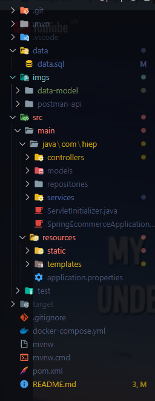

## Database entity relational diagram:
  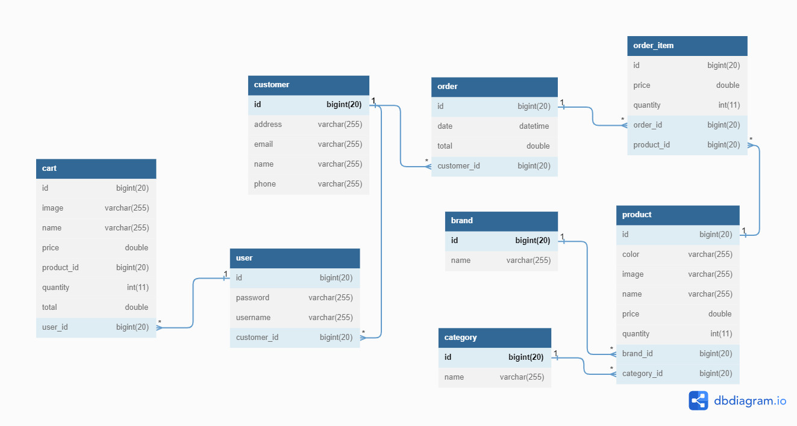


## Build and run the application:
- First, install [JDK](https://www.oracle.com/java/technologies/downloads/), [Maven](https://maven.apache.org/), [Docker](https://www.docker.com/) on your computer.
- After installed, navigate to the project directory and then run this to initial database (MySQL)
  
```bash
docker-compose up -d
```

- Add this environment variable to your computer 

```bash

```

- Once the database is running in docker, run the following command to build the application

```bash
mvnw spring-boot:run
```

- The application will run on http://localhost:8080

##  Full Postman snapshots to verify the APIs

### Check user login:
```bash
curl --location 'http://localhost:8080/api/user/login/user-valid' \
--header 'Content-Type: application/json' \
--data '{
    "username":"hiep",
    "password":"deptrai"
}'
```

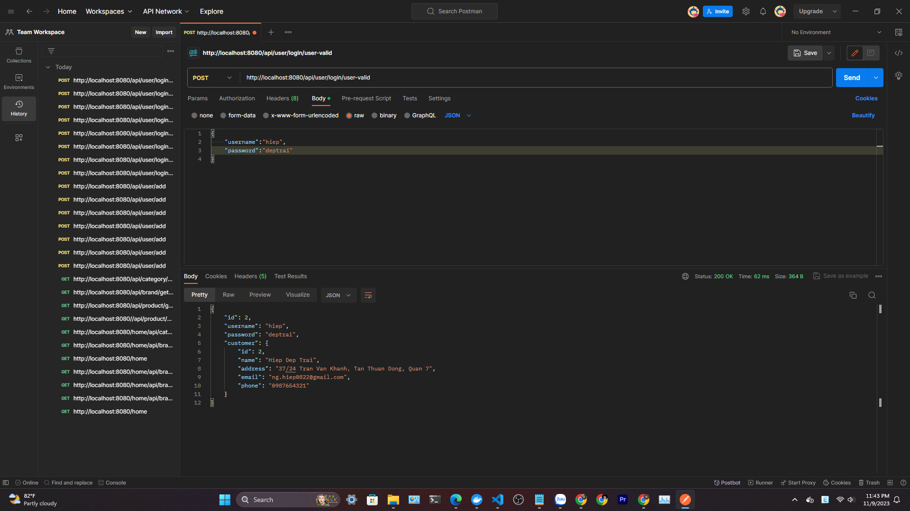

---

### Add new user (sign up):
```bash
curl --location 'http://localhost:8080/api/user/add' \
--header 'Content-Type: application/json' \
--data-raw '{
    "username":"hiepdeptrai",
    "password":"123456",
    "customer":{
        "name":"123456",
        "email":"kkk@gmail.com"
    }
}'
```

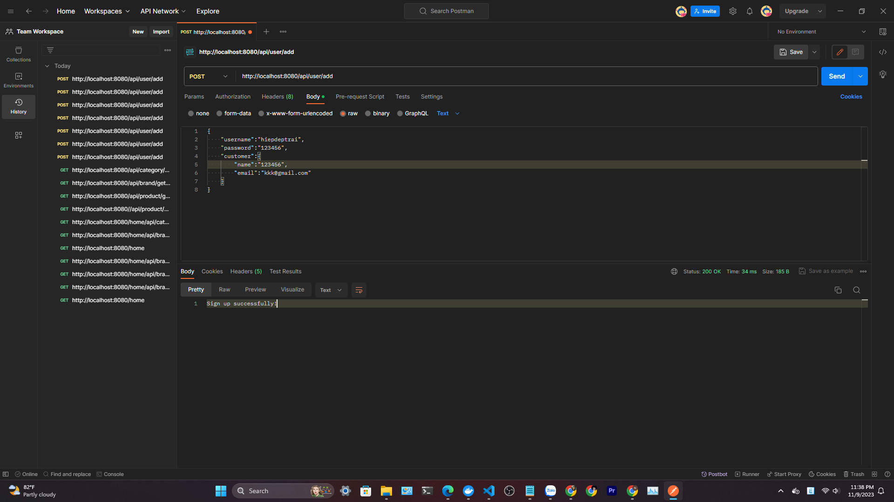

---

### Get all category:
```bash
curl --location 'http://localhost:8080/api/category/get-all'
```

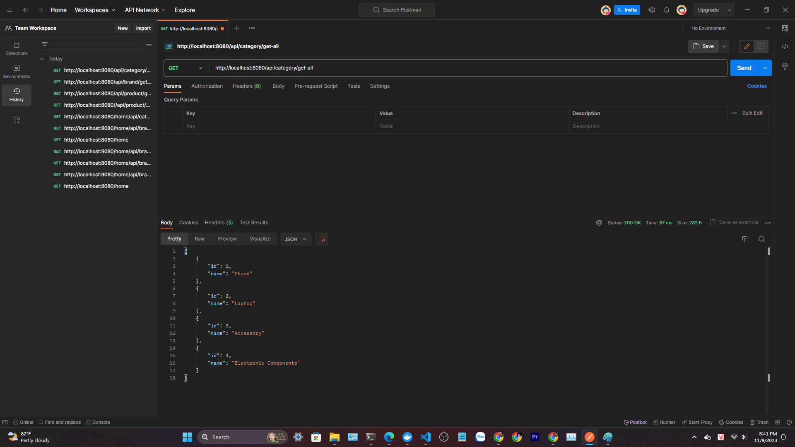

---

### Find Product by id:
```bash
curl --location --request GET 'http://localhost:8080/api/product/find/9' \
--header 'Content-Type: application/json' \
--data '{
    "user_id":2,
    "customer_id":2
}'
```

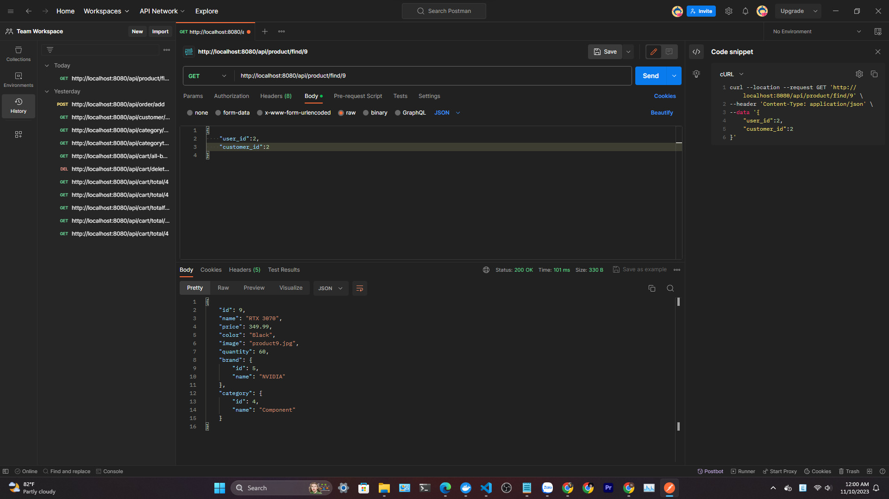

---

### Find Product by brand:
```bash
curl --location 'http://localhost:8080/api/product/find-by-brand-id/5' \
--data ''
```

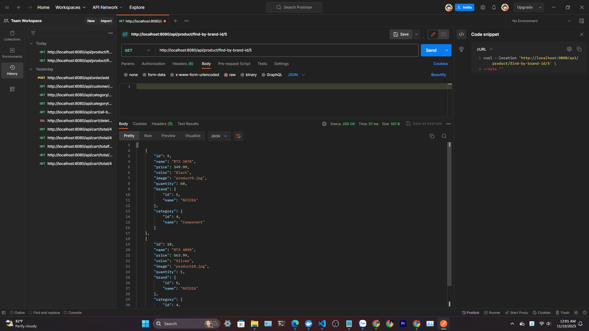

---

### Search product:
```bash
curl --location 'http://localhost:8080/api/product/search/sams' \
--data ''
```

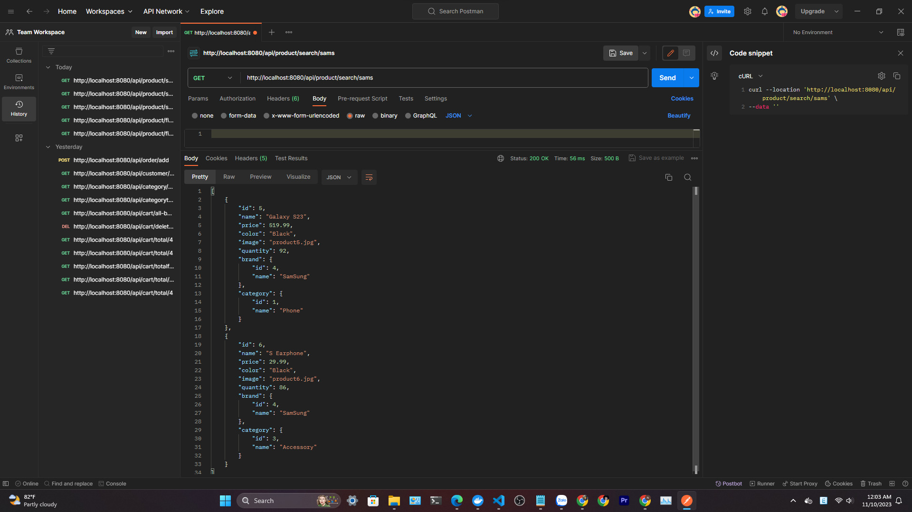

---

### Add product to card:
```bash
curl --location 'http://localhost:8080/api/cart/add' \
--header 'Content-Type: application/json' \
--data '{
    "user_id":2,
    "product_id":7,
    "quantity":23
}'
```

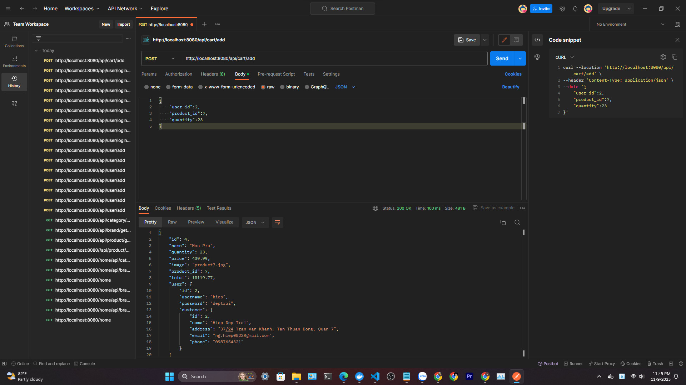

---

### Delete product from card:
```bash
curl --location --request DELETE 'http://localhost:8080/api/cart/delete/4'
```

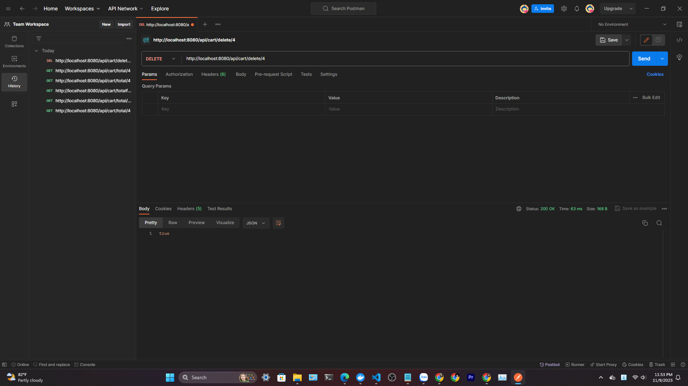

---

### Add to order:
```bash
curl --location 'http://localhost:8080/api/order/add' \
--header 'Content-Type: application/json' \
--data '{
    "user_id":2,
    "customer_id":2
}'
```

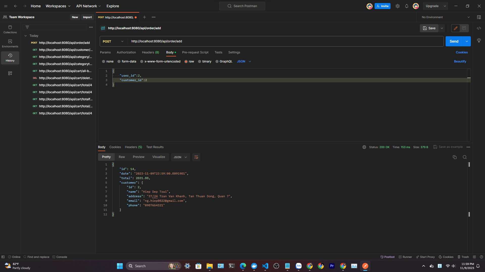

---


### Find customer:
```bash
curl --location 'http://localhost:8080/api/customer/find/2'
```

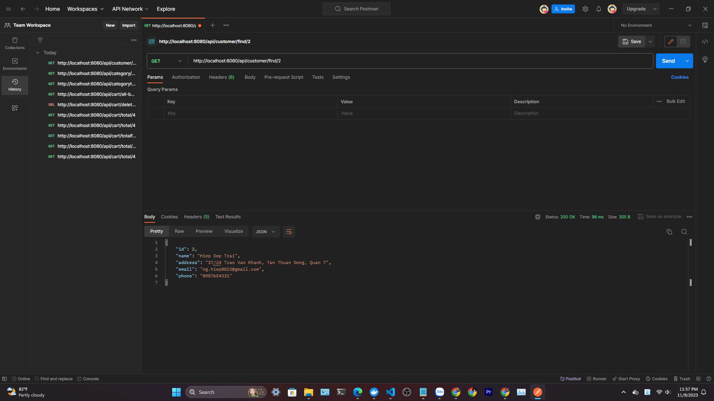

---

